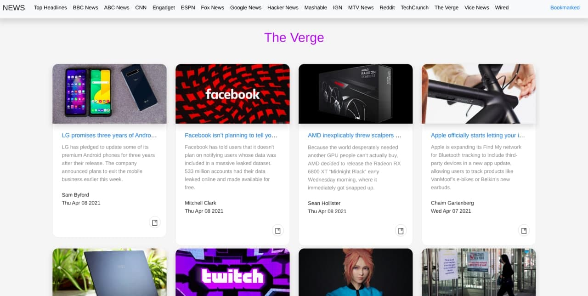
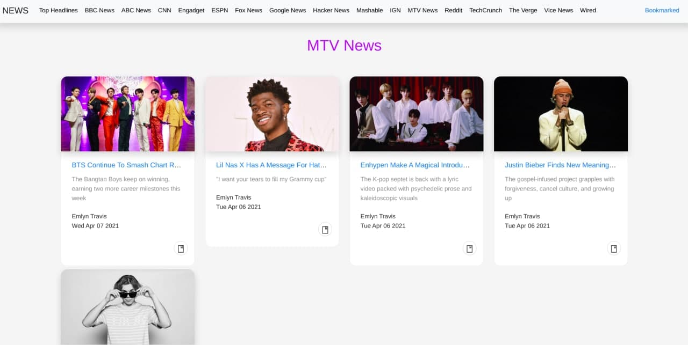

# A News reader made with React using Redux

## Installation

- Clone the repository

`git clone https://github.com/undefinedzack/NEWS_REDUX_REACT.git`

- cd into the main folder
- install node modules

`npm install`

- start the local server

`npm start`

## Features 

- News are available from various sources.
- Can bookmark liked news to a seperate tab.

## Screens

## Issues

Since newsapi.org doesn't allow requests from different sources other than localhost in a "developer account".

We get a status code 426 error after deployment. Well you can check error code at : https://news-redux-react-undefinedzack.vercel.app/

